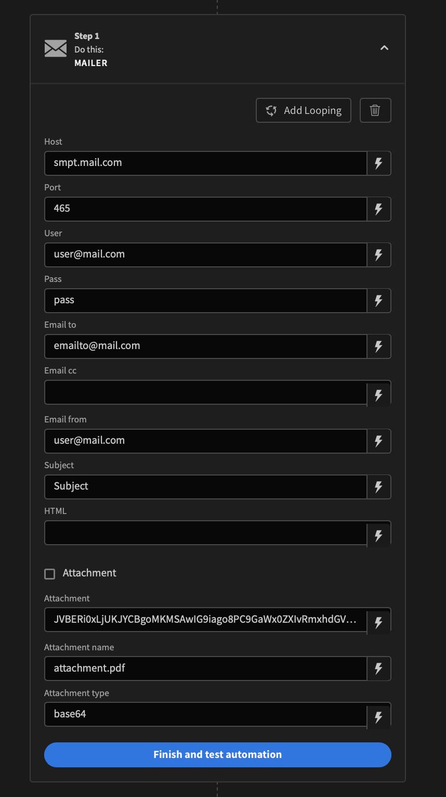

# Mailer
Smpt mail automaiton plugin for Budibase. 

# Description
This is a automation plugin for Budibase that integrates Nodemailer with Svelte Email. Send custom emails with smtp 

## Installation
To install the plugin for Budibase, follow these steps:

1. Copy the repository link 'https://github.com/m7kael/bbplugin-mailer.git'.
2. Open Budibase and navigate to the "Plugins" section.
3. Click add plugin.
4. Select GitHub source.
5. Put the link in the URL section

## Use

After the installation the plugin is ready to use with automations. Just enter the settings for your email provider and start sending mails. 

<b>Fields</b>

Host - Your email provider smpt server (example smpt.mail.com)
Port - Your email provider port (example 465)
User - The username for auth 
Pass - The password for auth
Email to - The recipents, comma separated when multiple (example user@mail.com, user2@mail.com,...)
Email cc - The cc recipents, same as email to
Email from - the email to send from
Subject - Subject of the email
Html - The email content in html
Select attachment if to include attachment
Attachment - The attachment, for example base64 string
Attachment name - The name of the attachment (example attachment.pdf)
Attachment type - The type of the attachment (example base64)

Example
<p></p>

## Instructions

To build your new  plugin run the following in your Budibase CLI:
```
budi plugins --build
```

You can also re-build everytime you make a change to your plugin with the command:
```
budi plugins --watch
```
# bbplugin-mailer
